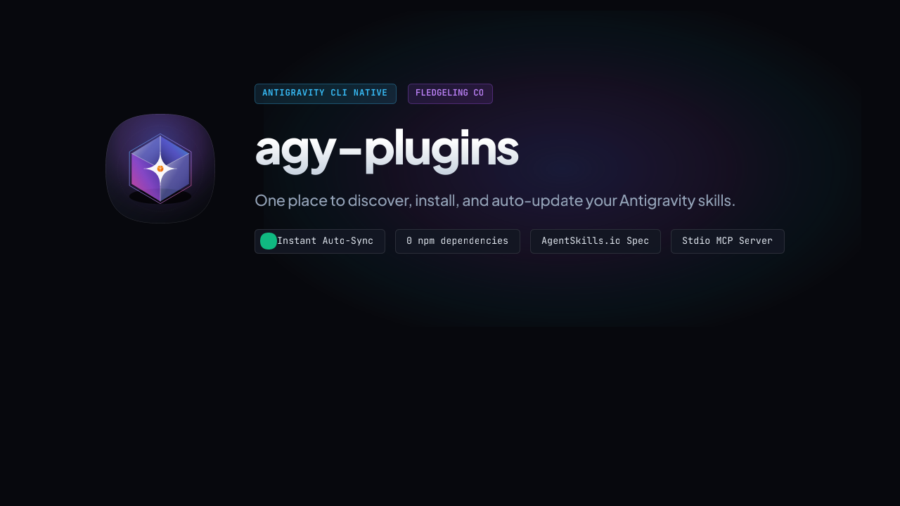

<p align="center">
  
</p>

<p align="center"><strong>From <a href="https://www.fledgeling.app">Fledgeling</a>.</strong><br />
Built and used daily by <a href="https://github.com/lprhodes">Luke Rhodes</a>; shipped when it's earned it.</p>

<p align="center">
  
  
  
  
  
</p>

---

## What this is

Think of `agy-plugins` as an App Store and auto-updater for your Antigravity AI assistant (`agy`).

When developers share AI skills and tools (like code reviewers, UX audit helpers, or project builders), they publish them in collections called plugin marketplaces on GitHub. Without a manager, getting those skills into your AI assistant means copying folders by hand, running git commands, and hoping you don't download gigabytes of files you'll never use.

`agy-plugins` takes care of all of that for you. It downloads only the specific skills you pick, links them directly into your AI assistant, and automatically updates them in the background so you're always on the newest version.

---

## The two ways to use it

You can use `agy-plugins` either by chatting naturally with your AI assistant, or through terminal commands.

### Method 1: Let your AI handle it (Recommended)

You can connect `agy-plugins` directly to your AI assistant using one command. Once connected, you can just ask your assistant in plain English to install or manage tools for you (e.g. *"Install the design-review skill from fledgeling-plugins"*).

To add it to Antigravity, run this single line in your terminal:

```bash
agy mcp add agy-plugins "node /Users/lukerhodes/Dev/agy-plugins/bin/agy-plugins.js mcp"
```

Everything you can do in the terminal, your AI assistant can now do for you automatically:
- Discover and search for new skills across all your added marketplaces.
- Install or remove skills with one sentence.
- Add new marketplace collections from GitHub.
- Check the health of your installed tools and automatically repair broken links.

---

### Method 2: Command-Line Shortcuts

`agy-plugins` gives you simple, familiar commands (matching the standard `skills.fledgeling.app` conventions):

#### 1. Adding Marketplaces
To add a collection of skills from GitHub:

```bash
# Add a marketplace from GitHub
agy-plugin marketplace add fledgeling-co/fledgeling-plugins
agy-plugin marketplace add DiologIR/diolog-plugins

# List all marketplaces you've registered
agy-plugin marketplace list

# Update all marketplaces (or a specific one)
agy-plugin marketplace update
agy-plugin marketplace update fledgeling-plugins
```

#### 2. Installing & Removing Skills
Once a marketplace is added, install only the specific skills you want:

```bash
# Install a skill from a specific marketplace
agy-plugin install trawl@fledgeling-plugins
agy-plugin install design-review@fledgeling-plugins
agy-plugin install create-swe-project@fledgeling-plugins

# Or install by name directly
agy-plugin install trawl

# Remove a skill when you no longer need it
agy-plugin uninstall trawl

# See all skills currently available or installed
agy-plugin list
agy-plugin list --installed
```

#### 3. Health Diagnostics (Doctor)
Check whether any tools have broken links or missing dependencies:

```bash
# Run the health check and automatically repair any issues
agy-plugin doctor --fix
```

---

### Method 3: The Visual Interactive Manager

If you prefer browsing and toggling skills visually with your keyboard:

> [!IMPORTANT]
> **Run this in its own separate Terminal tab or window.**
> 
> Open a fresh terminal window or tab (in Terminal, iTerm, or Ghostty) to run this command. Do not run it inside an active `agy` chat session; running an interactive full-screen visual menu inside an existing AI chat prompt will cause the two screens to overlap.

```bash
# In a fresh terminal tab:
agy-plugin
# or
node /Users/lukerhodes/Dev/agy-plugins/bin/agy-plugins.js
```

#### How to navigate the visual menu
- `1`, `2`, `3`, `4`: Switch between **Explore Skills**, **Marketplaces**, **Installed Tools**, and the **Doctor** health-check.
- `↑` / `↓` Arrow Keys: Move up and down the list.
- `Space` or `i`: Install or uninstall the highlighted skill.
- `/`: Type to instantly search for any skill by keyword.
- `u`: Pull the latest updates from GitHub right now.
- `q`: Exit the menu.

---

## Why it's fast and clean

- **Zero third-party code packages**: Built using standard Node.js built-ins. Nothing extra gets installed on your Mac, so it starts instantly.
- **Saves disk space**: Traditional git clones download the entire history of every project in a repository. `agy-plugins` uses smart partial downloads, which cuts disk usage by around 95%.
- **Instant updates**: Because skills are linked directly into your assistant, any updates from GitHub take effect immediately; no need to restart your AI tools.
- **Built-in health checker (Doctor)**: If a file gets moved or a tool needs a missing program to run, the doctor catches it and tells you in plain words how to resolve it.

---

## Design & Verification

- **[Icon Audit Sheet](file:///Users/lukerhodes/Dev/agy-plugins/assets/audit.html)**: Measured contact sheet auditing the Tahoe gel-glass icon across 6 size scales down to 16px.
- **[Structural Evals & Ledger](file:///Users/lukerhodes/Dev/agy-plugins/EVALS.md)**: Benchmark comparisons on download speeds, memory footprint, and token budgets.

---

## Licence

MIT. Do what you like; attribution appreciated.

## Elsewhere

Fledgeling is [Luke Rhodes](https://www.linkedin.com/in/lukerhodes/), also co-founder of [Diolog](https://diolog.app).

[fledgeling.app](https://www.fledgeling.app) · [GitHub](https://github.com/lprhodes) · [X](https://x.com/lp_rhodes) · [LinkedIn](https://www.linkedin.com/in/lukerhodes/) · [hello@fledgeling.app](mailto:hello@fledgeling.app)
